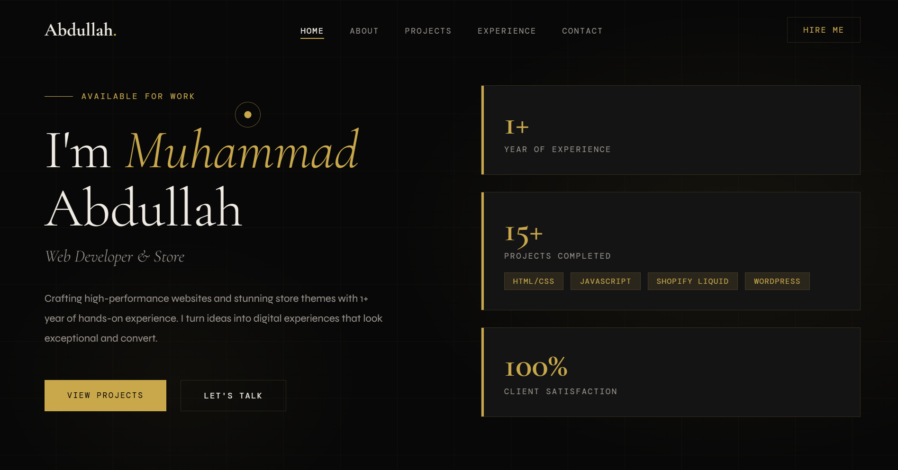
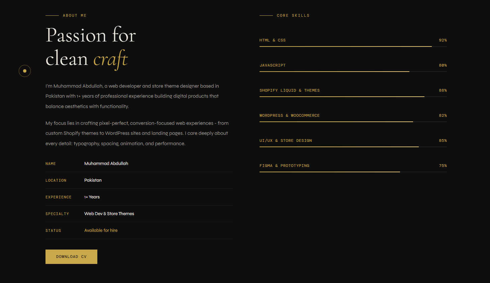
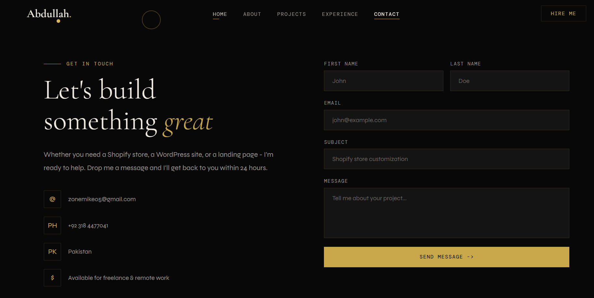

# 🌐 Personal Portfolio Website

This is my personal portfolio website where I showcase my:

- 💻 Projects
- 🚀 Skills
- 📚 Learning Journey
- 🏆 Achievements
- 📞 Contact Information

## 📁 Project Structure

```
Portfolio-Website/
├── index.html
├── pages/
│   ├── about.html
│   ├── contact.html
│   ├── experience.html
│   └── projects.html
├── assets/
│   ├── css/
│   │   └── style.css
│   └── js/
│       └── script.js
├── screenshots/
│   ├── home-page.png
│   ├── projects-section.png
│   └── contact-page.png
└── README.md
```

## ✨ Features

- Responsive Design
- Smooth Navigation
- Projects Showcase
- Skills Section
- Contact Form
- Clean UI/UX

## 🛠️ Technologies Used

- HTML5
- CSS3
- JavaScript (ES6+)

## � Getting Started

To view the portfolio locally:

1. Clone the repository:
   ```bash
   git clone https://github.com/your-username/Portfolio-Website.git
   ```

2. Navigate to the project directory:
   ```bash
   cd Portfolio-Website
   ```

3. Open `index.html` in your web browser.

## �📸 Preview

### Home Page


### Core Skills


### Contact Page


## 🌍 Live Demo

[Preview](https://itx-abdullah-wd.github.io/Portfolio/index.html)
